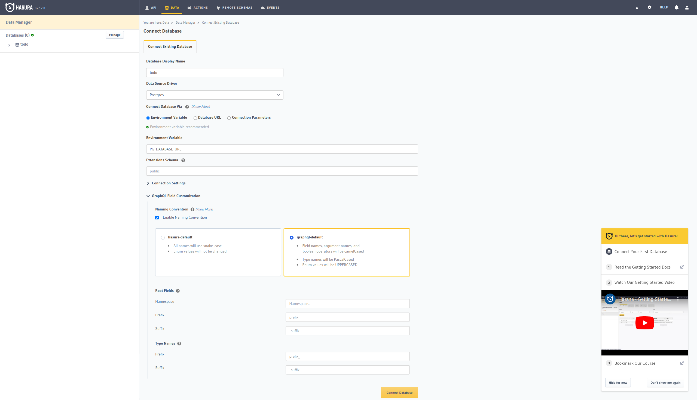
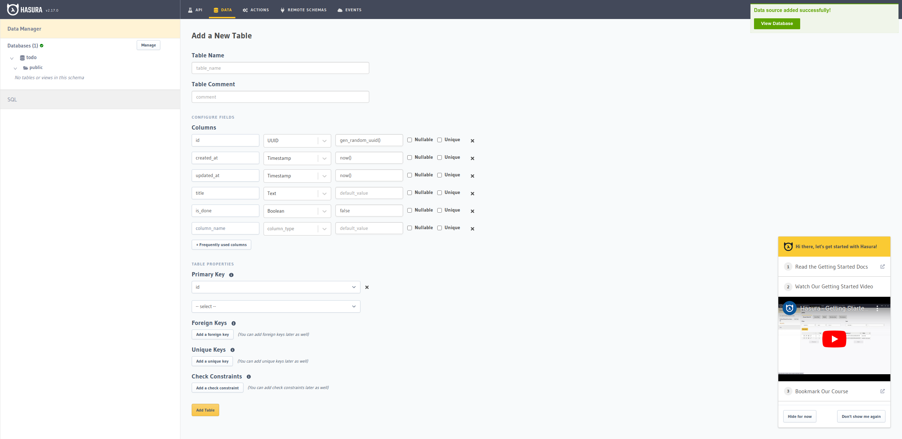

# hasura-todo

## Set up

### Hasura を設定する

**1. docker を使用してサーバーを建てる**

```
docker-compose up -d
```

**2. `localhost:8080`に行く**

**3. database と接続する**



`Database Display Name` => todo

`Environment Variable` => PG_DATABASE_URL

`GraphQL Field Customization/Naming Convention` => graphql-default 4. table を作成する

**4. table を作成する**


`Table Name` => todos

`Columns`
| Name | Type | Default |
| ---------- | --------- | ----------------- |
| id | uuid | gen_random_uuid() |
| created_at | timestamp | now() |
| updated_at | timestamp | now() |
| title | text | |
| is_down | boolean | false |

### Nuxt を起動する

```
cd client
npm i
npm run dev
```

`localhost:3000`に行く
